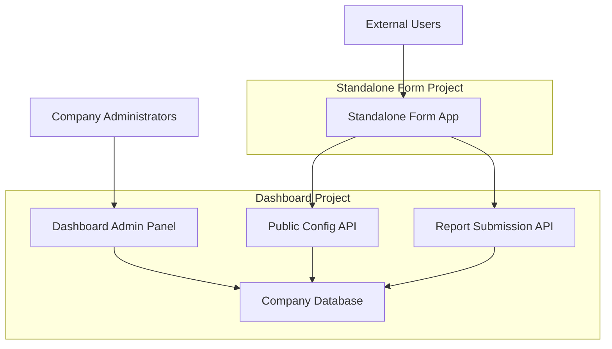

# Whistleblowing Form Separation Plan

## Executive Summary

This document outlines a comprehensive plan to extract the whistleblowing form functionality from the main dashboard project into a separate, standalone Next.js application. This separation will provide better security, performance, and maintainability while maintaining full integration with the dashboard's configuration and branding system.

## Table of Contents

1. [Current System Analysis](#current-system-analysis)
2. [Architecture Overview](#architecture-overview)
3. [Technical Implementation](#technical-implementation)
4. [API Design](#api-design)
5. [Project Structure](#project-structure)
6. [Component Migration](#component-migration)
7. [Configuration Management](#configuration-management)
8. [Security Implementation](#security-implementation)
9. [Deployment Strategy](#deployment-strategy)
10. [Implementation Timeline](#implementation-timeline)
11. [Testing Strategy](#testing-strategy)
12. [Maintenance & Monitoring](#maintenance--monitoring)

## Current System Analysis

### Existing Form Components

- **Primary Form**: `components/forms/ReportForm.tsx`
- **Form Fields**: `components/forms/ReportFormFields.tsx`
- **File Upload**: `components/forms/FileUploadSection.tsx`
- **Tracking Options**: `components/forms/TrackingOptions.tsx`
- **Success Page**: `components/forms/ReportSuccess.tsx`

### Current Dependencies (that won't be available)

- Company store (`store/companyStore.ts`) - **Not available in standalone project**
- Report submission hook (`hooks/useReportSubmission.ts`) - **Will be recreated**
- Company settings fallback (`components/utils/fallback.ts`) - **Will be replaced with API calls**
- UI components (`components/ui/`) - **Can be copied to new project**
- Internationalization (`next-intl`) - **Can be set up independently**

### Configuration Sources

- Company settings in `company_settings` table
- Branding and customization in `companies.customization`
- Form categories and validation rules
- File upload restrictions and settings

## Architecture Overview

### High-Level Design



### Separation Benefits

1. **Complete Independence**: Form app operates independently with no direct database connection
2. **Security**: Reduced attack surface for public-facing forms
3. **Performance**: Lightweight form application loads faster
4. **Scalability**: Independent scaling and deployment
5. **Maintainability**: Separate codebases and update cycles
6. **Flexibility**: Support for embeddable widgets and multiple deployment options

## Technical Implementation

### Technology Stack

**Standalone Form Project:**

- **Framework**: Next.js 14 with App Router (new project setup)
- **Styling**: Tailwind CSS with dynamic theming (new configuration)
- **State Management**: React hooks (no external state management needed)
- **Form Validation**: Zod for schema validation (new implementation)
- **File Handling**: Built-in Next.js file upload capabilities (recreated)
- **Internationalization**: next-intl (new setup with copied message files)
- **UI Components**: Copied from dashboard project (`components/ui/`)
- **Form Logic**: Completely rewritten for API-based architecture

**Dashboard Project Updates:**

- **New API Endpoints**: Public configuration and submission endpoints
- **CORS Configuration**: Cross-origin resource sharing setup
- **Security Enhancements**: Input validation and basic rate limiting
- **No Architectural Changes**: Existing database and auth system unchanged

## API Design

### Communication Pattern

The standalone form application will communicate with the dashboard project **only** through HTTP API calls:

1. **Configuration Fetching**: Form app calls dashboard's public config API
2. **Report Submission**: Form app calls dashboard's public submission API
3. **Report Tracking**: Form app calls dashboard's public tracking API
4. **No Direct Database Access**: Form app has no database connections
5. **No Shared Dependencies**: Completely independent deployments

### 1. Public Configuration API

**Endpoint**: `GET /api/public/forms/{subdomain}/config`

**Purpose**: Fetch company-specific form configuration without authentication

**Response Schema**:

```typescript
interface PublicFormConfig {
  company: {
    id: string
    name: string
    subdomain: string
  }
  branding: {
    name: string
    logo: string
    subdomain: string
  }
  colors: {
    primary: string
    accent: string
    success: string
    error: string
  }
  content: {
    welcomeTitle: string
    welcomeSubtitle: string
    footerText: string
    privacyPolicy: string
    contactEmail: string
  }
  categories: Array<{
    id: string
    name: string
    description: string
    color: string
    isActive: boolean
  }>
  formSettings: {
    allowAnonymous: boolean
    requireEmail: boolean
    allowFileUploads: boolean
    maxFileSize: number
    maxFiles: number
    allowedFileTypes: string[]
    trackingModes: string[]
    enableTracking: boolean
  }
}
```

### 2. Public Report Submission API

**Endpoint**: `POST /api/public/reports/submit`

**Purpose**: Submit whistleblowing reports from external form

**Request Schema**:

```typescript
interface ReportSubmissionRequest {
  subdomain: string
  categoryId: string
  subject: string
  description: string
  trackingMode: 'public' | 'private'
  trackingPassword?: string
  isAnonymous: boolean
  priority?: 'low' | 'medium' | 'high' | 'urgent'
  files?: File[]
}
```

**Response Schema**:

```typescript
interface ReportSubmissionResponse {
  success: boolean
  trackingId: string
  message?: string
  error?: string
}
```

### 3. Report Tracking API

**Endpoint**: `GET /api/public/reports/track/{trackingId}`

**Purpose**: Allow users to track their report status

**Response Schema**:

```typescript
interface ReportTrackingResponse {
  success: boolean
  report?: {
    trackingId: string
    status: string
    subject: string
    createdAt: string
    updatedAt: string
    comments: Array<{
      content: string
      isInternal: boolean
      createdAt: string
    }>
  }
  error?: string
}
```

## Project Structure

### Standalone Form Application

```
whistleblowing-form/
├── README.md
├── package.json
├── next.config.js
├── tailwind.config.ts
├── tsconfig.json
├── .env.example
├── .env.local
├── public/
│   ├── favicon.ico
│   └── default-logo.svg
├── src/
│   ├── app/
│   │   ├── layout.tsx
│   │   ├── globals.css
│   │   ├── page.tsx                     # Landing/redirect page
│   │   ├── [subdomain]/
│   │   │   ├── page.tsx                 # Main form page
│   │   │   ├── success/
│   │   │   │   └── page.tsx             # Success page
│   │   │   └── track/
│   │   │       └── [trackingId]/
│   │   │           └── page.tsx         # Tracking page
│   │   ├── api/
│   │   │   ├── submit/
│   │   │   │   └── route.ts             # Form submission (calls dashboard API)
│   │   │   ├── config/
│   │   │   │   └── [subdomain]/
│   │   │   │       └── route.ts         # Config fetching (calls dashboard API)
│   │   │   └── track/
│   │   │       └── [trackingId]/
│   │   │           └── route.ts         # Tracking (calls dashboard API)
│   │   └── not-found.tsx
│   ├── components/
│   │   ├── form/
│   │   │   ├── ReportForm.tsx           # Main form component
│   │   │   ├── FormFields.tsx           # Form input fields
│   │   │   ├── CategorySelect.tsx       # Category selection
│   │   │   ├── FileUploadSection.tsx    # File upload component
│   │   │   ├── TrackingOptions.tsx      # Tracking mode selection
│   │   │   ├── PrivacySection.tsx       # Privacy notice
│   │   │   └── SubmitButton.tsx         # Submit button with loading
│   │   ├── tracking/
│   │   │   ├── TrackingForm.tsx         # Tracking lookup form
│   │   │   └── ReportStatus.tsx         # Status display
│   │   ├── layout/
│   │   │   ├── Header.tsx               # Dynamic header with branding
│   │   │   ├── Footer.tsx               # Company footer
│   │   │   └── PageLayout.tsx           # Main layout wrapper
│   │   ├── ui/
│   │   │   ├── Button.tsx               # Button component
│   │   │   ├── Input.tsx                # Input component
│   │   │   ├── Textarea.tsx             # Textarea component
│   │   │   ├── Select.tsx               # Select component
│   │   │   ├── Card.tsx                 # Card component
│   │   │   ├── Alert.tsx                # Alert component
│   │   │   ├── LoadingSpinner.tsx       # Loading component
│   │   │   └── FileUpload.tsx           # File upload UI
│   │   └── providers/
│   │       ├── ThemeProvider.tsx        # Dynamic theming
│   │       └── ConfigProvider.tsx       # Configuration context
│   ├── lib/
│   │   ├── api.ts                       # Dashboard API client
│   │   ├── config.ts                    # Configuration management
│   │   ├── validation.ts                # Form validation schemas
│   │   ├── utils.ts                     # Utility functions
│   │   ├── constants.ts                 # Application constants
│   │   └── types.ts                     # TypeScript type definitions
│   ├── hooks/
│   │   ├── useFormConfig.ts             # Configuration fetching hook
│   │   ├── useReportSubmission.ts       # Form submission hook
│   │   ├── useFileUpload.ts             # File upload hook
│   │   └── useTracking.ts               # Report tracking hook
│   └── styles/
│       ├── globals.css                  # Global styles
│       └── themes.css                   # Dynamic theme variables
├── messages/                            # Internationalization
│   ├── en.json
│   ├── de.json
│   └── sl.json
└── docs/
    ├── deployment.md
    ├── configuration.md
    └── troubleshooting.md
```

### Dashboard API Client (Form Project)

```typescript
// src/lib/api.ts
class DashboardApiClient {
  private baseUrl: string

  constructor() {
    this.baseUrl = process.env.DASHBOARD_API_URL || 'http://localhost:3000'
  }

  async getFormConfig(subdomain: string): Promise<PublicFormConfig> {
    const response = await fetch(`${this.baseUrl}/api/public/forms/${subdomain}/config`, {
      headers: {
        'Content-Type': 'application/json',
      },
    })

    if (!response.ok) {
      throw new Error(`Failed to fetch config: ${response.statusText}`)
    }

    return response.json()
  }

  async submitReport(data: ReportSubmissionRequest): Promise<ReportSubmissionResponse> {
    const response = await fetch(`${this.baseUrl}/api/public/reports/submit`, {
      method: 'POST',
      headers: {
        'Content-Type': 'application/json',
      },
      body: JSON.stringify(data),
    })

    if (!response.ok) {
      throw new Error(`Failed to submit report: ${response.statusText}`)
    }

    return response.json()
  }

  async trackReport(trackingId: string): Promise<ReportTrackingResponse> {
    const response = await fetch(`${this.baseUrl}/api/public/reports/track/${trackingId}`, {
      headers: {
        'Content-Type': 'application/json',
      },
    })

    if (!response.ok) {
      throw new Error(`Failed to track report: ${response.statusText}`)
    }

    return response.json()
  }
}

export const dashboardApi = new DashboardApiClient()
```

## Component Development Strategy

### 1. UI Components to Copy

**Reusable UI Components** (copy directly from dashboard project):

```bash
# Copy these files from dashboard to standalone project:
cp components/ui/Button.tsx        → src/components/ui/Button.tsx
cp components/ui/Input.tsx         → src/components/ui/Input.tsx
cp components/ui/Textarea.tsx      → src/components/ui/Textarea.tsx
cp components/ui/Select.tsx        → src/components/ui/Select.tsx
cp components/ui/Card.tsx          → src/components/ui/Card.tsx
cp components/ui/Alert.tsx         → src/components/ui/Alert.tsx
cp components/ui/LoadingSpinner.tsx → src/components/ui/LoadingSpinner.tsx
cp components/ui/Icons.tsx         → src/components/ui/Icons.tsx
```

**Note**: These components should work as-is since they're generic UI components with no dashboard-specific dependencies.

**Additional Files to Copy**:

- `messages/en.json` → Copy relevant form-related translations
- `messages/de.json` → Copy relevant form-related translations
- `messages/sl.json` → Copy relevant form-related translations
- Tailwind CSS utilities and color classes

### 2. Form Components to Recreate

**New Form Components** (built from scratch for the standalone project):

#### ReportForm Component

```typescript
// src/components/form/ReportForm.tsx
interface ReportFormProps {
  config: PublicFormConfig
  onSubmissionSuccess: (trackingId: string) => void
}

export function ReportForm({ config, onSubmissionSuccess }: ReportFormProps) {
  // Built from scratch with:
  // - API-based configuration
  // - Dynamic theming from config
  // - Standalone submission logic
  // - No dashboard dependencies
}
```

#### FormFields Component

```typescript
// src/components/form/FormFields.tsx
interface FormFieldsProps {
  formData: FormData
  categories: CategoryConfig[]
  onInputChange: (field: string, value: string) => void
  errors: ValidationErrors
}

export function FormFields({ formData, categories, onInputChange, errors }: FormFieldsProps) {
  // New implementation with:
  // - Dynamic categories from API config
  // - Client-side validation with Zod
  // - Accessibility improvements
  // - Better error handling
}
```

#### FileUpload Component

```typescript
// src/components/form/FileUploadSection.tsx
interface FileUploadProps {
  files: File[]
  maxFiles: number
  maxSize: number
  allowedTypes: string[]
  onFilesChange: (files: File[]) => void
}

export function FileUploadSection({ files, maxFiles, maxSize, allowedTypes, onFilesChange }: FileUploadProps) {
  // New features:
  // - Drag and drop functionality
  // - Progress indicators
  // - File validation based on API config
  // - Better UX for file management
}
```

### 3. Layout Components to Build

**Brand New Components** for the standalone project:

#### Dynamic Header

```typescript
// src/components/layout/Header.tsx
interface HeaderProps {
  branding: BrandingConfig
  colors: ColorConfig
}

export function Header({ branding, colors }: HeaderProps) {
  // Company logo and branding
  // Dynamic color theming
  // Responsive design
}
```

#### Themed Footer

```typescript
// src/components/layout/Footer.tsx
interface FooterProps {
  content: ContentConfig
  branding: BrandingConfig
}

export function Footer({ content, branding }: FooterProps) {
  // Company-specific footer content
  // Contact information
  // Privacy policy links
}
```

## Configuration Management

### Dynamic Theming System

```typescript
// src/lib/config.ts
export function applyCompanyTheme(colors: CompanyColors) {
  const root = document.documentElement
  root.style.setProperty('--color-primary', colors.primary)
  root.style.setProperty('--color-accent', colors.accent)
  root.style.setProperty('--color-success', colors.success)
  root.style.setProperty('--color-error', colors.error)
}

// src/components/providers/ThemeProvider.tsx
export function ThemeProvider({
  children,
  config
}: {
  children: React.ReactNode
  config: PublicFormConfig
}) {
  useEffect(() => {
    applyCompanyTheme(config.colors)
  }, [config.colors])

  return (
    <div className="theme-provider">
      {children}
    </div>
  )
}
```

### Configuration Caching

```typescript
// src/lib/config.ts
interface CachedConfig {
  config: PublicFormConfig
  timestamp: number
}

const configCache = new Map<string, CachedConfig>()
const CACHE_DURATION = 5 * 60 * 1000 // 5 minutes

export async function getFormConfig(subdomain: string): Promise<PublicFormConfig | null> {
  const cacheKey = subdomain
  const cached = configCache.get(cacheKey)

  if (cached && Date.now() - cached.timestamp < CACHE_DURATION) {
    return cached.config
  }

  try {
    // Call dashboard API directly (no database connection)
    const response = await fetch(`${process.env.DASHBOARD_API_URL}/api/public/forms/${subdomain}/config`)

    if (!response.ok) {
      throw new Error(`API request failed: ${response.status}`)
    }

    const config = await response.json()

    configCache.set(cacheKey, {
      config,
      timestamp: Date.now(),
    })

    return config
  } catch (error) {
    console.error('Failed to fetch form config:', error)
    return null
  }
}
```

## Security Implementation

### 1. Rate Limiting

**Dashboard API Protection (In-Memory)**:

```typescript
// lib/rateLimiting.ts
interface RateLimitEntry {
  count: number
  resetTime: number
}

const rateLimitMap = new Map<string, RateLimitEntry>()

export function rateLimit(
  identifier: string,
  limit: number = 10,
  windowMs: number = 60000 // 1 minute
): { allowed: boolean; remaining: number; resetTime: number } {
  const now = Date.now()
  const key = identifier

  // Clean up expired entries
  if (rateLimitMap.size > 10000) {
    for (const [k, entry] of rateLimitMap.entries()) {
      if (entry.resetTime < now) {
        rateLimitMap.delete(k)
      }
    }
  }

  const entry = rateLimitMap.get(key)

  if (!entry || entry.resetTime < now) {
    // First request or window expired
    const resetTime = now + windowMs
    rateLimitMap.set(key, { count: 1, resetTime })
    return { allowed: true, remaining: limit - 1, resetTime }
  }

  if (entry.count >= limit) {
    // Rate limit exceeded
    return { allowed: false, remaining: 0, resetTime: entry.resetTime }
  }

  // Increment count
  entry.count++
  rateLimitMap.set(key, entry)

  return { allowed: true, remaining: limit - entry.count, resetTime: entry.resetTime }
}

// Usage in API routes
export function withRateLimit(identifier: string) {
  const result = rateLimit(identifier, 10, 60000) // 10 requests per minute

  if (!result.allowed) {
    throw new Error('Rate limit exceeded')
  }

  return result
}
```

### 2. Input Validation

**Form Validation Schema**:

```typescript
// src/lib/validation.ts
import { z } from 'zod'

export const reportSubmissionSchema = z.object({
  subdomain: z
    .string()
    .min(3)
    .max(63)
    .regex(/^[a-z0-9]([a-z0-9-]*[a-z0-9])?$/),
  categoryId: z.string().uuid(),
  subject: z.string().min(5).max(500),
  description: z.string().min(10).max(5000),
  trackingMode: z.enum(['public', 'private']),
  trackingPassword: z.string().min(6).max(50).optional(),
  isAnonymous: z.boolean(),
  priority: z.enum(['low', 'medium', 'high', 'urgent']).optional(),
})

export type ReportSubmissionData = z.infer<typeof reportSubmissionSchema>
```

### 3. File Upload Security

```typescript
// src/lib/fileValidation.ts
export function validateFile(file: File, allowedTypes: string[], maxSize: number): { valid: boolean; error?: string } {
  // File type validation
  const fileExtension = '.' + file.name.split('.').pop()?.toLowerCase()
  if (!allowedTypes.includes(fileExtension)) {
    return {
      valid: false,
      error: `File type ${fileExtension} is not allowed`,
    }
  }

  // File size validation
  if (file.size > maxSize * 1024 * 1024) {
    return {
      valid: false,
      error: `File size exceeds ${maxSize}MB limit`,
    }
  }

  // Additional security checks
  if (file.name.includes('..') || file.name.includes('/')) {
    return {
      valid: false,
      error: 'Invalid file name',
    }
  }

  return { valid: true }
}
```

### 4. CORS Configuration

**Dashboard API CORS Setup**:

```typescript
// src/app/api/public/*/route.ts
export async function GET(request: NextRequest) {
  const response = NextResponse.json(data)

  // CORS headers
  response.headers.set('Access-Control-Allow-Origin', process.env.FORMS_DOMAIN || '*')
  response.headers.set('Access-Control-Allow-Methods', 'GET, POST, OPTIONS')
  response.headers.set('Access-Control-Allow-Headers', 'Content-Type')

  return response
}
```

## Deployment Strategy

### Option 1: Separate Domains

**Configuration**:

- Dashboard: `admin.yourapp.com`
- Forms: `forms.yourapp.com/{subdomain}`

**Benefits**:

- Clear separation of concerns
- Easy to configure different security policies
- Simple subdomain routing

**DNS Configuration**:

```
admin.yourapp.com    -> Dashboard server
forms.yourapp.com    -> Forms server
*.forms.yourapp.com  -> Forms server (for subdomain routing)
```

### Option 2: Subdomain Detection

**Configuration**:

- Dashboard: `admin.yourapp.com`
- Forms: `{subdomain}.yourapp.com`

**Benefits**:

- Cleaner URLs for companies
- Better branding experience
- Single domain management

**Implementation**:

```typescript
// middleware.ts (Forms project)
export function middleware(request: NextRequest) {
  const hostname = request.headers.get('host') || ''
  const subdomain = hostname.split('.')[0]

  // Skip admin subdomain
  if (subdomain === 'admin' || subdomain === 'www') {
    return NextResponse.redirect(new URL('https://admin.yourapp.com'))
  }

  // Rewrite to subdomain route
  return NextResponse.rewrite(new URL(`/${subdomain}${request.nextUrl.pathname}`, request.url))
}
```

### Option 3: Embeddable Widget

**Configuration**:

- Iframe embedding: `<iframe src="https://forms.yourapp.com/embed/{subdomain}">`
- JavaScript widget: `<script src="https://forms.yourapp.com/widget.js" data-company="{subdomain}"></script>`

**Benefits**:

- Companies can embed directly in their websites
- Seamless integration with company branding
- Single-page application approach

### Docker Configuration

**Dockerfile (Forms Project)**:

```dockerfile
FROM node:18-alpine AS base

WORKDIR /app
COPY package*.json ./
RUN npm ci --only=production

FROM base AS build
COPY . .
RUN npm run build

FROM node:18-alpine AS runtime
WORKDIR /app
COPY --from=build /app/.next ./.next
COPY --from=build /app/public ./public
COPY --from=build /app/package*.json ./
RUN npm ci --only=production

EXPOSE 3000
CMD ["npm", "start"]
```

**docker-compose.yml**:

```yaml
version: '3.8'
services:
  forms-app:
    build: .
    ports:
      - '3001:3000'
    environment:
      - DASHBOARD_API_URL=https://admin.yourapp.com
      - NODE_ENV=production
    restart: unless-stopped

  nginx:
    image: nginx:alpine
    ports:
      - '80:80'
      - '443:443'
    volumes:
      - ./nginx.conf:/etc/nginx/nginx.conf
      - ./ssl:/etc/ssl
    depends_on:
      - forms-app
```

## Implementation Timeline

### Phase 1: Foundation (Week 1-2)

- [ ] Set up new Next.js project from scratch
- [ ] Copy basic UI components from dashboard project (`Button`, `Input`, `Card`, etc.)
- [ ] Create TypeScript types and interfaces for API communication
- [ ] Implement configuration fetching system and API client
- [ ] Set up development environment and tooling

### Phase 2: Dashboard API (Week 2-3)

- [ ] Create public configuration API endpoint
- [ ] Create public report submission API endpoint
- [ ] Implement rate limiting and security measures
- [ ] Add CORS configuration
- [ ] Test API endpoints

### Phase 3: Form Implementation (Week 3-4)

- [ ] Copy basic UI components from dashboard project
- [ ] Build form components from scratch (ReportForm, FormFields, FileUpload)
- [ ] Implement dynamic theming system
- [ ] Add form validation and error handling with Zod
- [ ] Create success and tracking pages
- [ ] Build layout components (Header, Footer) with branding support

### Phase 4: Integration Testing (Week 4-5)

- [ ] Test form submission flow
- [ ] Verify branding and theming
- [ ] Test file uploads
- [ ] Cross-browser testing
- [ ] Mobile responsiveness testing

### Phase 5: Deployment Setup (Week 5-6)

- [ ] Set up production hosting
- [ ] Configure DNS and SSL certificates
- [ ] Set up monitoring and logging
- [ ] Performance optimization
- [ ] Security hardening

### Phase 6: Documentation & Launch (Week 6)

- [ ] Complete documentation
- [ ] Create admin guide for configuration
- [ ] User acceptance testing
- [ ] Production deployment
- [ ] Monitor and optimize

## Testing Strategy

### Unit Testing

```typescript
// src/components/form/__tests__/ReportForm.test.tsx
import { render, screen, fireEvent, waitFor } from '@testing-library/react'
import { ReportForm } from '../ReportForm'
import { mockFormConfig } from '../../__mocks__/config'

describe('ReportForm', () => {
  it('renders form with company branding', () => {
    render(<ReportForm config={mockFormConfig} onSubmissionSuccess={jest.fn()} />)
    expect(screen.getByText(mockFormConfig.branding.name)).toBeInTheDocument()
  })

  it('validates required fields', async () => {
    render(<ReportForm config={mockFormConfig} onSubmissionSuccess={jest.fn()} />)

    fireEvent.click(screen.getByText('Submit Report'))

    await waitFor(() => {
      expect(screen.getByText('Subject is required')).toBeInTheDocument()
    })
  })
})
```

### Integration Testing

```typescript
// src/__tests__/integration/formSubmission.test.ts
import { test, expect } from '@playwright/test'

test('complete form submission flow', async ({ page }) => {
  await page.goto('/demo')

  // Fill form
  await page.fill('[data-testid="subject"]', 'Test Report')
  await page.fill('[data-testid="description"]', 'This is a test description')
  await page.selectOption('[data-testid="category"]', 'fraud')

  // Submit form
  await page.click('[data-testid="submit-button"]')

  // Verify success
  await expect(page.locator('[data-testid="success-message"]')).toBeVisible()
  await expect(page.locator('[data-testid="tracking-id"]')).toContainText(/^[A-Z]+-\d+[A-Z0-9]+$/)
})
```

### Performance Testing

```typescript
// src/__tests__/performance/loadTesting.js
import http from 'k6/http'
import { check, sleep } from 'k6'

export let options = {
  vus: 100, // Virtual users
  duration: '5m',
  thresholds: {
    http_req_duration: ['p(95)<2000'], // 95% of requests under 2s
    http_req_failed: ['rate<0.01'], // Less than 1% failure rate
  },
}

export default function () {
  const response = http.get('https://forms.yourapp.com/demo')
  check(response, {
    'status is 200': r => r.status === 200,
    'page loads in <2s': r => r.timings.duration < 2000,
  })
  sleep(1)
}
```

## Maintenance & Monitoring

### Health Checks

```typescript
// src/app/api/health/route.ts
export async function GET() {
  try {
    // Check dashboard API connectivity
    const dashboardHealth = await fetch(`${process.env.DASHBOARD_API_URL}/api/health`, {
      timeout: 5000, // 5 second timeout
    })

    // Check if we can fetch a test configuration (no auth required)
    const formConfigTest = await fetch(`${process.env.DASHBOARD_API_URL}/api/public/forms/demo/config`, {
      timeout: 5000,
    })

    const status = dashboardHealth.ok && formConfigTest.ok ? 'healthy' : 'degraded'

    return NextResponse.json({
      status,
      timestamp: new Date().toISOString(),
      services: {
        dashboard_api: dashboardHealth.ok,
        config_api: formConfigTest.ok,
      },
      dependencies: {
        dashboard_url: process.env.DASHBOARD_API_URL,
      },
    })
  } catch (error) {
    return NextResponse.json(
      {
        status: 'unhealthy',
        error: error.message,
        timestamp: new Date().toISOString(),
      },
      { status: 500 }
    )
  }
}
```

### Logging Setup

```typescript
// src/lib/logger.ts
import { createLogger, format, transports } from 'winston'

export const logger = createLogger({
  level: process.env.LOG_LEVEL || 'info',
  format: format.combine(format.timestamp(), format.errors({ stack: true }), format.json()),
  defaultMeta: { service: 'whistleblowing-form' },
  transports: [
    new transports.File({ filename: 'error.log', level: 'error' }),
    new transports.File({ filename: 'combined.log' }),
    new transports.Console({
      format: format.simple(),
    }),
  ],
})
```

### Monitoring Metrics

- **Performance**: Page load times, dashboard API response times
- **Errors**: Form submission failures, API connectivity issues
- **Usage**: Form completion rates, popular categories, unique visitors
- **Dependencies**: Dashboard API availability, configuration fetch success rate
- **Security**: Rate limit violations, invalid submission attempts

### Backup Strategy

- **No Database**: Form project has no database to back up
- **Configuration**: Fetched dynamically from dashboard API
- **Code**: Git repository with automated deployments
- **Static Assets**: Minimal - only default logos and UI assets

## Success Criteria

### Technical Metrics

- [ ] Form loads in < 2 seconds
- [ ] 99.9% uptime for form submissions
- [ ] < 1% form submission error rate
- [ ] Mobile responsive across all devices

### Business Metrics

- [ ] No disruption to existing form submissions
- [ ] Maintain all existing branding capabilities
- [ ] Support for all current file upload requirements
- [ ] Maintain reporting and analytics via dashboard API

### Security Requirements

- [ ] Pass security vulnerability scans
- [ ] Implement proper rate limiting
- [ ] Secure file upload handling
- [ ] Data protection compliance

## Conclusion

This separation plan provides a comprehensive approach to extracting the whistleblowing form into a completely independent standalone application. The form project operates autonomously with **no direct database connections** and communicates with the dashboard **only** through well-defined HTTP API endpoints.

### Key Architecture Benefits:

1. **Complete Independence**: Form app can be deployed, scaled, and maintained separately
2. **API-Only Communication**: Clean separation through HTTP APIs eliminates tight coupling
3. **No Shared Infrastructure**: Each project can use different hosting, CDNs, and configurations
4. **Simplified Security**: Reduced attack surface with no database access from public form
5. **Easy Maintenance**: Independent updates and deployments without affecting each other

The phased implementation approach minimizes risks and allows for iterative testing and refinement throughout the development process. The in-memory rate limiting solution eliminates the need for Redis while still providing adequate protection for the expected traffic volumes.
